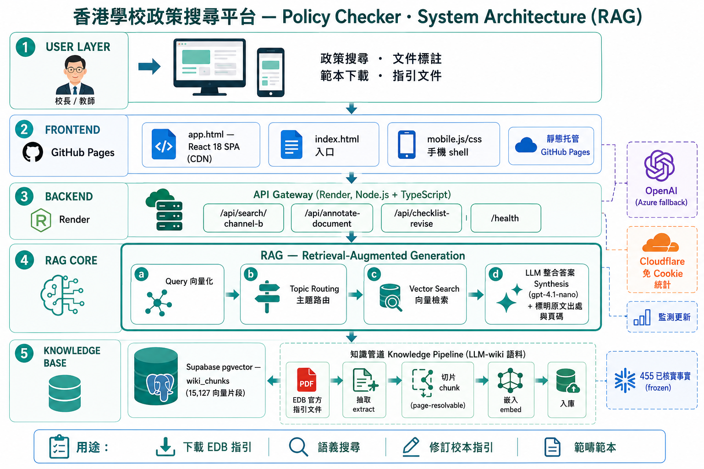

# 學校管理知識中心（K1 知識平台）

> 香港教育局（EDB）政策知識庫 — 專為學校管理人員而設

[](CHANGELOG.md)
[-lightgrey)](CHANGELOG.md)
[]()
[](https://leonard-wong-git.github.io/edb-knowledge/app.html)
[](https://edb-knowledge.onrender.com/health)

---

## 🔗 連結

| | URL |
|---|---|
| **知識平台（主應用）** | https://leonard-wong-git.github.io/edb-knowledge/app.html |
| **入口頁** | https://leonard-wong-git.github.io/edb-knowledge/ |
| **Quick Q&A** | https://leonard-wong-git.github.io/edb-knowledge/q.html |
| **後端 API** | https://edb-knowledge.onrender.com |

---

## 功能簡介

| 功能 | 說明 |
|------|------|
| ℹ️ **平台介紹** | 平台定位、動態統計（455 已核實事實 / 17,593 知識片段 / 177 指引 / 288 來源，由 `_meta.stats` 動態取）、核心功能說明 |
| 🔍 **政策搜尋** | Channel-B 語義搜尋：從 17,593 個 EDB 官方原文知識片段檢索，整理回答並附原始文件出處（含頁碼） |
| 📝 **文件標註** | 上載學校文件（Word/.docx 最佳，或 PDF/貼文字），系統比對 EDB 指引 + 按合規清單檢查缺漏，生成一份**乾淨成品版** Word（S167）：原文保持乾淨可讀、AI 建議融入正文做普通文字（以「（建議補充）」標示、無螢光、可直接編輯、毋須接受修訂），所有建議說明與 EDB 官方出處集中文末附錄；Word/PDF/貼文字皆出。檔案在瀏覽器內抽取及生成，原始檔案不上載。**S161 合併** 舊「文件分析 + 文件修訂」兩 tab 而成（支援本校校類 小/中/特/幼 + 合規範疇 自動偵測／自選） |
| 📋 **範本下載** | 15 範疇學校版政策範本（可編輯 .docx）下載，可按校類（通用/小/中/特/幼）篩選（內部「文件要求清單」不對外列出；S162 +幼稚園營運範疇） |
| 📚 **指引文件庫** | 161 份官方 EDB 指引（in-app 瀏覽庫；公開 `guidelines.json` 端點為 152 份全集投影），按類別 → 子類別 → 年份三層分組導覽 |

> 公眾 app（`app.html`）為 **Channel-B-only 唯讀** 五 tab 介面（平台介紹 / 政策搜尋 / 📝 文件標註 / 範本下載 / EDB指引；S151 移除 admin；S161 將 文件分析+文件修訂 合併為「文件標註」、政策範本→範本下載）。Channel A 人工策展 / 管理員登入功能已移除；`role_facts.json` / `knowledge.json` 凍結 @455 仍作對外資料契約。

### 📱 響應式 / 手機版範圍

`mobile.css` + `mobile.js` 偵測 ≤640px 或手機 UA 時啟用手機 shell，底部導航 **4 個入口**：🔍 搜尋 / 📚 指引文件 / 📋 範本下載 / ℹ️ 平台介紹。首次開啟顯示 **4 步導覽（onboarding tour）**，再引導選擇崗位角色（`k1_mobile_tour_v1` localStorage gate）。

| 功能 | 手機 | 桌面 |
|------|:----:|:----:|
| 政策搜尋 / 指引文件 / 平台介紹 | ✅ 完整 | ✅ |
| 📋 範本下載 | ⤷ 顯示「桌面版功能」說明 + 桌面面板截圖示意（範本為可編輯 Word 檔，建議用電腦下載編輯） | ✅ 完整下載 |
| 📝 文件標註 | — 桌面版功能（涉及檔案上載 + Word/PDF 生成，需較大畫面） | ✅ 完整 |

> 詳見 `dev/PROJECT_MASTER_SPEC.md` §B.5 Mobile UI scope。

## 涵蓋主題

- 💰 **財務 / 採購 / 津貼** — 採購程序、報價門檻、整筆撥款、代課教師津貼
- 👥 **人力資源** — CPD、批假政策、專業操守、調任安排
- 📖 **課程** — PECG 2024、八個 KLA、五種基要學習經歷、STEAM
- 🏃 **校外活動** — 境外活動、戶外活動、全方位學習津貼
- 🧒 **學生事務** — 訓育、反欺凌、SEN 融合教育、出席記錄
- 💻 **資訊科技** — 資訊保安政策、BYOD、數據保安
- 🏫 **通用行政** — 法團校董會、公開資料守則、學校行政手冊

---

## 技術架構



> 系統架構總覽（RAG）：用戶 → 前端（app.html / React SPA / GitHub Pages）→ 後端（Render · Node.js + TypeScript · API Gateway）→ RAG 核心（Query 嵌入 → 主題路由 → 向量搜尋 → LLM 合成）→ 知識庫（Supabase pgvector 17,593 chunks + 455 已核實事實）；外部：OpenAI（Azure 備援）、Cloudflare 免 Cookie 統計。

**現行公開後端端點（Render · Node.js + TypeScript）：**

| 端點 | 用途 |
|---|---|
| `POST /api/search/channel-b` | 政策搜尋（語義檢索 + LLM 合成） |
| `POST /api/analyze-document` · `POST /api/annotate-document` | 文件標註（逐段比對 EDB 指引 / 生成標註成品） |
| `POST /api/checklist-revise` · `GET /api/checklist-domains` | 合規清單 gap 檢查 / 範本範疇 |
| `GET /health` | 健康檢查 |

> Channel A（已核實事實）凍結 @455；`q.html` / 合併搜尋 / 通告分析入口為休眠狀態（backend route 保留、前端入口已移除）。

### Frontend
- **Single-file React SPA** — `app.html`（React 18 + Babel + Tailwind CSS 2.2，全部 CDN）
- 靜態托管於 GitHub Pages，無需構建工具

### Backend
- **Node.js + TypeScript**，托管於 [Render](https://render.com) 免費 tier
- **Channel A 搜尋**：對 455 條已審核事實做語義搜尋（OpenAI `text-embedding-3-small`）
- **通告分析**：LLM 提取主題、影響角色、政策要點
- 冷啟動約 30 秒（Render 免費 tier idle 15 分鐘後自動關閉）

### 知識管道

**Channel A — 人工審核（主線）**
```
EDB PDF → extract_candidates.py → candidate_queue.json
→ Admin 審核（inline edit）→ role_facts.json → knowledge.json
```

**Channel B — 全 AI（副線，Phase 2）**
```
EDB PDF → ai_extract.py → wiki_index.json（向量索引）
→ /api/search/channel-b → 智能搜尋 UI
```

---

## 知識庫狀態

| 項目 | 數量 |
|------|------|
| Channel A 已審核事實 | **455 條** |
| 指引文件庫（in-app 瀏覽） | **161 份** |
| 來源文件 | **120 份** |
| Channel B 向量索引 | **17,593 chunks**（Supabase pgvector，線上） |

> 註：由 792 條去重整合至 455 條唯一事實（2026-05-16，commit 711f911；可逆日誌 `dev/DEDUP_LOG_2026-05-16.md`）。
> 註：`161` 為 in-app 指引瀏覽庫（總文件基礎，S140 landing-curate +9 + 公積金 +4）；公開 `guidelines.json` API 端點為其全集投影 **152** 份（S140，剔 9 非文件；由 `dev/build_guidelines.py` 生成）。

---

## 文件結構

```
edb-knowledge/
├── app.html                    # K1 知識平台主應用（React SPA）
├── index.html                  # 入口頁
├── q.html                      # Quick Q&A（本地 knowledge.json 搜尋）
├── t-purchase.html             # 採購範本流程
├── role_facts.json             # Channel A 知識庫（公開 API）
├── knowledge.json              # 知識庫副本（供 EDB 通告系統調用）
├── guidelines.json             # 指引文件庫（公開 API）
├── CHANGELOG.md                # 版本歷史
├── backend/                    # Node.js TypeScript 後端
│   ├── src/
│   │   ├── server.ts           # HTTP server + 路由
│   │   ├── api/                # 各端點處理器
│   │   └── lib/                # embeddingClient、knowledgeRepository 等
│   └── package.json
└── dev/
    ├── knowledge/
    │   ├── role_facts.json     # Channel A 事實庫（source of truth）
    │   ├── policy_signals.json # Circular System 政策訊號
    │   └── candidate_queue.json
    ├── vault/                  # PDF 提取腳本
    ├── CODEBASE_CONTEXT.md     # 平台整體架構說明
    ├── CIRCULAR_SYSTEM_INTEGRATION.md  # edb_scraper.py 整合規格
    └── SESSION_HANDOFF.md      # 開發工作日誌
```

---

## 本地開發

### 前端
直接在瀏覽器開啟 `app.html`，或用任何靜態伺服器。

### 後端
```bash
cd backend
cp .env.example .env          # 填入 OPENAI_API_KEY
npm install
npm run dev                   # 啟動於 http://localhost:8787
```

環境變數（`backend/.env`）：
```
OPENAI_API_KEY=sk-...
OPENAI_MODEL=gpt-4.1-nano
PORT=8787
CORS_ORIGIN=https://leonard-wong-git.github.io
KNOWLEDGE_PATH=../../../dev/knowledge/role_facts.json
```

---

## 版本歷史

詳見 [CHANGELOG.md](CHANGELOG.md)

---

## 數據來源

所有事實均來自香港教育局官方文件，包括教育局通告、課程指引、學校行政手冊等 120 份文件。每條事實均附原始文件連結，確保可追溯性。

---

*最後更新：2026-06-25 | 平台 v3.3.1（知識資料合約 knowledge.json 維持凍結 v2.3.0）| 維護：leonard-wong-git*
