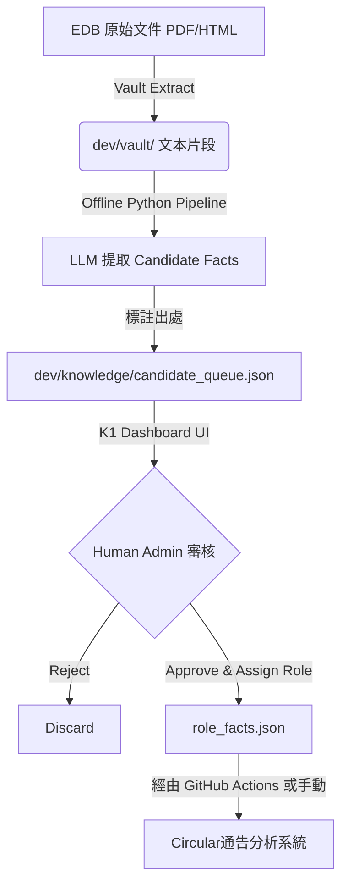

# K1 Knowledge Platform — Phase 3 系統架構與新 UI 設計

Phase 3 的核心是建立 **「可延展、重證據」的知識提取管道（Evidence-First Pipeline）**，同時**重構使用者介面**，以反映系統重心的轉移（從系統除錯轉向知識營運與 LLM-Wiki）。

---

## 1. 架構：Evidence-First 提取管道

為了避免 LLM「幻覺」並確保每條規則都有 EDB 出處可查，我們採用 **LLM 提議 → 人手審批** 的雙層架構：

### 資料結構變化
- **`candidate_queue.json` (新增)**:
  存放 LLM 從 Vault 自動提取出來但未審批的知識點。
  每條包含：`{ "id", "proposed_text", "source_id", "source_quote", "suggested_topic", "suggested_roles" }`
- **`role_facts.json` (現有)**:
  繼續作為唯一的 "Approved Facts" SSOT。

---

## 2. 介面重心重構 (UI Redesign)

原本的 `k1-dashboard.html` 混雜了「後台測試功能」與「前台知識展示」。新的 UI 佈局應明確區分 **前端一般訪客** 與 **知識營運管理者 (Admin)** 的視角。

### 移除 / 降級的功能：
- ❌ **移除「📋 通告分析 (Circular Analysis)」頁籤**：
  這是用於測試與後端對接的除錯功能，不需要在前台常駐顯示。
  **替代方案**：在系統頂部 Header 的統計區域，提供一個整合指標：`[⚡ 通告系統連線：已供應 107 條事實]`。如果 Admin 想做 Semantic Regression 測試，可以在後台跑 CLI，或把原本的畫面收納進 Admin 設定裡的隱藏 Modal 控制面板。

### 全新主導航 (View Modes)：

#### 1. 🔍 智能搜尋 (LLM-Wiki) — [預定主頁面]
- **定位**：面向全校教職員/使用者的首頁。
- **功能**：輸入問題，檢索 `role_facts.json` 及 `guidelines.json`，給出答案並**附上 EDB 原文 PDF/網頁連結**。目前已經存在的功能，但可以做為 UI 預設顯示畫面。

#### 2. 📚 指引文件庫 (Registry)
- **定位**：EDB 資料庫。
- **功能**：原來的 "guidelines" view，展示所有 `source_registry` 中的 145+ 份文件及直接下載連結。

#### 3. ✍️ 知識提煉 (Candidate Review) — [**Admin Only 🌟 新功能**]
- **定位**：Phase 3 的核心審核後台。
- **功能**：專門讀取 `candidate_queue.json`。
- **UI 佈局**：
  - **清單/卡片式**：
  - **左側/上方**：LLM 提議的短句 (Candidate Fact) 與建議的 Topic/Role。
  - **右側/下方**：EDB 原文段落展示 (Source Quote) 與來源連結，方便 Admin 快速核對「LLM 到底有沒有亂講」。
  - **操作**：【修改並 Approve】 / 【直接 Approve】 / 【Reject】。
  - Approve 後，這條 fact 會從 Queue 移出，進入本機狀態的 Approved 列表。

#### 4. ⚙️ 事實管理 (Fact Dashboard) — [Admin Only]
- **定位**：原本的 "knowledge" view。
- **功能**：管理已 approved 的所有 facts，修改、分類、導出 Snapshot 回寫。

---

## 3. Phase 3 實施步驟建議

1. **Step 1: UI 重構與精簡**
   - 從 `k1-dashboard.html` 移除 `circular-analysis` tab。
   - 將主頁預設設為「智能搜尋 (QA / LLM-Wiki)」。
   - 加入整合的 `[⚡ 供應通告系統: <計數>]` 指標。
2. **Step 2: Candidate Queue Data Model 定義**
   - 建立 `dev/knowledge/candidate_queue.json` 的 JSON schema，並放入幾筆 Mock Data 以便在 Dashboard 開發 Review UI。
3. **Step 3: Review UI 開發**
   - 在 Dashboard 加上這套有「證據對照」的 Approve 介面。
4. **Step 4: LLM Extraction Pipeline (Python)**
   - 寫一個獨立的 Python 腳本 (e.g., `dev/vault/extract_candidates.py`)，它的職責是讀取 Vault 裡的一份純文本，用 OpenAI API 生成 JSON array，並寫入 `candidate_queue.json`。
